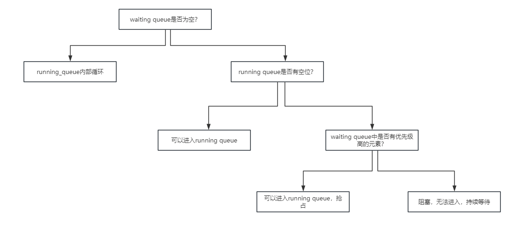
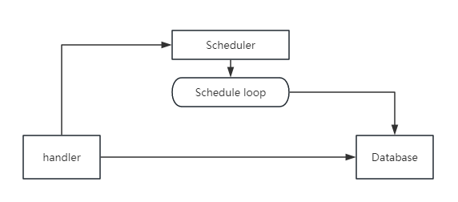

# 设计方案

业务层面的东西，任何一个请求到来了，应该先在业务方面做修改，业务稳定了，再向数据库发送持久化请求。


从请求侧来区分：

首先是可能造成层删改的请求：

+ /api/rooms/checkIn  可能有新记录建立
+ /api/rooms/checkOut  有新记录建立、有修改
+ /api/turn_on   有建立、修改
+ /api/turn_off  有建立、修改
+ /api/setTemperature
+ /api/setSpeed


只有查的请求：

+ /api/login
+ /api/query_room_bill
+ /api/query_schedule
+ /api/detail_bill
+ /api/form/roomList
+ /api/query_room_info/

# 数据库表设计
## 房间表

房间表：room_id(pk), client_id(varchar), checkin_time(datetime), checkout_time(datetime), state(int), cost(float), current_speed(string), current_tempera(float32)


## 操作表
操作表：id(pk), room_id(int), op_time(datetime), optype(int), old(varchar), new(varchar)

用户的操作主要有以下几种：
+ 开关空调
+ 调整温度
+ 调整风速

所以optype暂时定为1-3.
+ 当optype为1时，old_state和new_state分别为开和关，
+ 当optype为2时，old_state和new_state分别为之前的温度值、设定后的温度值。
+ 当optype为3时，old_state和new_state分别为风速的旧值和新值。比如说low, medium, high

操作表的核心作用就是作为一个reference。


## 详单表
详单表：id(pk), room_id(int), query_time(datetime), start_time(datetime), end_time(datetime), serve_time(float), speed(varchar), cost(float), rate(float), status(varchar)

详单表只用作一个记录，是结果表，不具备任何reference的意义。


# 调度算法设计
有且仅有调整风速的时候，会被scheduler掌握。

这个是按照风速大小进行调度的。当一个新的风速设定到来之后，如果发生了时间片的抢占，那么先会记录这个操作入库（操作表）

然后这个操作的任务会进入scheduler的waiting_queue中。然后会依次处理里面的请求。这个是任务的waiting_queue，不是当前房间的waiting_queue

风速越大，优先级越高。比如说如果有high存在的话，有可能medium和low都会被挤占，甚至hunger（这是文档规定的），我们只负责实现与执行代码工程，不负责质疑老师的要求。

当task_waiting_queue里面有任务的时候，我们从中读取任务，然后进行调度。任务先出队，然后决定它在serving_queue中还是在waiting_queue中。

我们需要一个数据结构，来记录房间的serve进展。

Slots: room_id, start_time, speed即可。

之后就是校验时间、滚动这个slots中的房间位置，


只有第一个管道，传输进来的信息，决定list中slot的滚动状态。scheduler内部的step仅仅负责进行滚动操作。

维护两个队列：waiting_queue和running_queue.

任何一个元素，在最初的时候都是在waiting queue当中。之后会被调度进入running queue。

整体调度的决策树是：




__有关结算__

结束的时候要进行结算，去详单里面结算。只有能够被结算的房间才会被持久化到数据库中，比如说仅仅是时间片被抢占出来了，不能被结算，因为query_time是请求到来的时间、start_time是开始服务的时间，中途可能被抢占出来，并不算做serve结束了，因此end_time和serve_time这两个字段没有办法填充数据，这个时候就不算做结算。

重申：只有彻底退出了serve任务的，才能够被结算。

不想进行数据库的设计工作，也就是不想设计接口，在我们这里全部使用嵌入式SQL语句。

有关结算，我觉得应该单独开一个goroutine来执行。一方面是执行最底层的普通房间的费用，另一方面是执行来自schedule的结果的费用。scheduler把信息通过管道传输给结算系统，结算系统来进行结算。


```go
if waiting_queue.Len() > 0 {
    if running_queue.Len() < s.ServingSize {
        // 可以进入
    } else {
        first_e_run := running_queue.Front()
        first_e_wait := waiting_queue.Front()
        if first_e_wait.Value.(*Slot).Speed >= first_e_run.Value.(*Slot).Speed {
            // 发生抢占
        }
        // 如果到这里了，说明waiting会阻塞。
    }
} else {
	// running queue内部循环
}
```


# 项目设计方案

考虑到有一个scheduler，我们将让这个scheduler持有两个goroutine。

一个负责进行scheduler的step操作，每隔一秒钟step一次，进行调度算法的工作。

另一个负责处理来自handler的任务。面对到来的请求，我们在handler层就已经可以进行数据库IO操作。在经过数据库IO之后，再把信息数据更新给Scheduler，便于Scheduler进行Step。

如图所示：



这种设计出于两个考虑：

+ 如果是先把数据发送给scheduler，再由scheduler决定数据是否持久化到数据库中。整个过程比较复杂，比如说：
    + scheduler要还要涉及一堆判断逻辑，需要判断要把handler的信息中的哪些内容，更新到哪个表中，这是很复杂的判断逻辑
    + Task不好写，因为task的种类繁多，不可能全部覆盖完，代码量会非常恐怖。
    + scheduler本身还要进行schedule，schedule完了之后还要把schedule的内容给IO到数据库里面，加上之前的IO，他要分别进行两种不同的IO操作。
+ Scheduler仅仅是负责scheduler，它基于的信息来源就是自己的一套信息，它输出的地方就是数据库。所以其实是handler和scheduler都要对数据库有CRUD操作。scheduler除了schedule的逻辑之外，不负责执行任何除此之外的任务。


# TODO

进行scheduler的数据库IO操作，记录时间、进行计算。

完成结算的设计。
